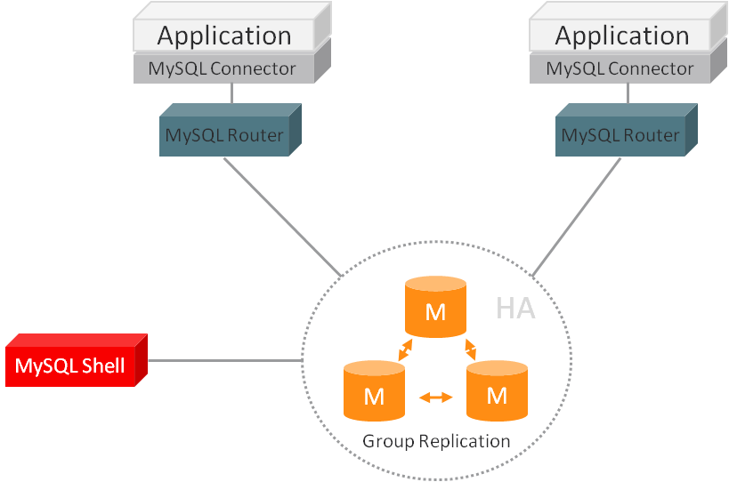

# 第3章 部署 MySQL Router

**目录**

- [3.1 引导 MySQL Router](./03.01.引导 MySQL Router.md)
- [3.2 在沙盒中尝试 MySQL Router](./03.02.在沙盒中尝试 MySQL Router.md)
- [3.3 基本连接路由](./03.03.基本连接路由.md)

## 性能建议

为了获得最佳性能，MySQL Router 通常安装在使用它的应用程序所在的同一主机上。可能的原因包括：

- 允许应用程序使用本地 UNIX 域套接字连接，而不是 TCP/IP。

  > **注意**
  >
  > UNIX 域套接字可以用于连接到 MySQL Router 的应用程序，但不适用于 MySQL Router 连接到 MySQL 服务器。

- 减少网络延迟。

- 允许 MySQL Router 连接到 MySQL，而无需为 Router 的主机额外创建 MySQL 账户，适用于专门为应用程序主机创建的 MySQL 账户，例如 myapp@198.51.100.45 而不是像 myapp@% 这样的值。

- 通常应用服务器最容易扩展。

您可以在网络上运行多个 MySQL Router 实例，并且不需要将 MySQL Router 限制在单一机器上。这是因为 MySQL Router 对任何特定的服务器或主机没有亲和性。

**图 3.1 MySQL Router 部署示例**

